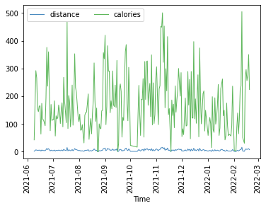
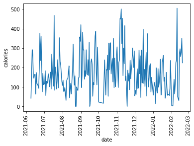
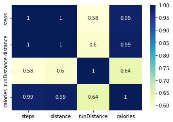

# Exploring Smart Band Data (MI BAND 5)

#### Test Subject:

- Gender: Male

- Height: 178cm

- Weight: 72kg

- BMI: 24.1

- Age: 20

by the way, this data is of my band 😁, so don't judge me.

### Activity

The subject uses around **163.49-gram calories** (684.04216 Jules) in a day, equivalent to around **2 apples** [1].

maximum distance traveled by test subject is **15.411km(22558 steps)** in a day, ran **0.88km**, total calories burn over the day is **505**, on **2022-02-10**.

consumption of calories over time is very unregular having a **MAD of 64.0** and **SD of 103.031**.

distance travel is quite stable having a **MAD of 1.83** and **SD of 3.09**.

#### Activity Data Co-relation matrix

I don't run much that's why it's like this.

In Activity data, less than 21% of data is extreme outliers.

## References

1. [Carbohydrate and Calorie Content of Foods By Item | MomsTeam](https://www.momsteam.com/nutrition/sports-nutrition-basics/nutritional-needs-guidelines/carbohydrate-and-calorie-content-of-foods)
